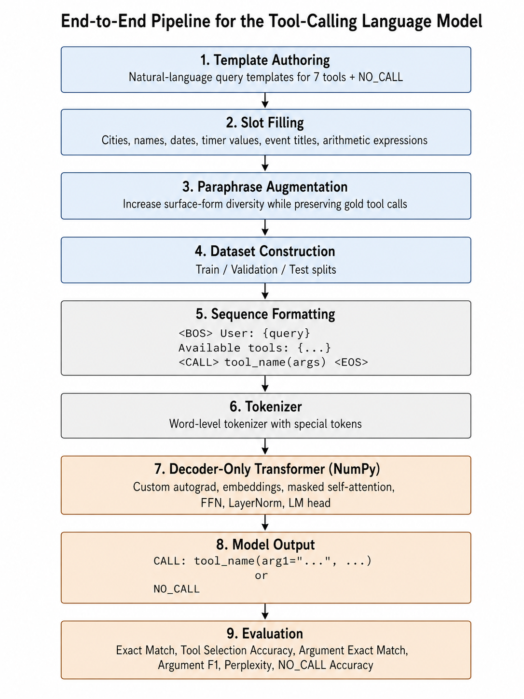
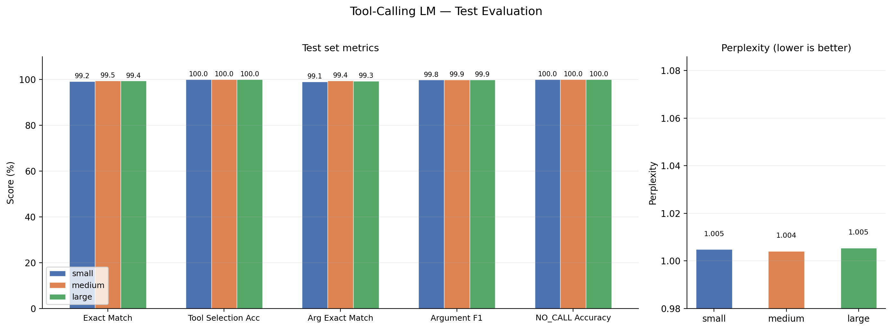
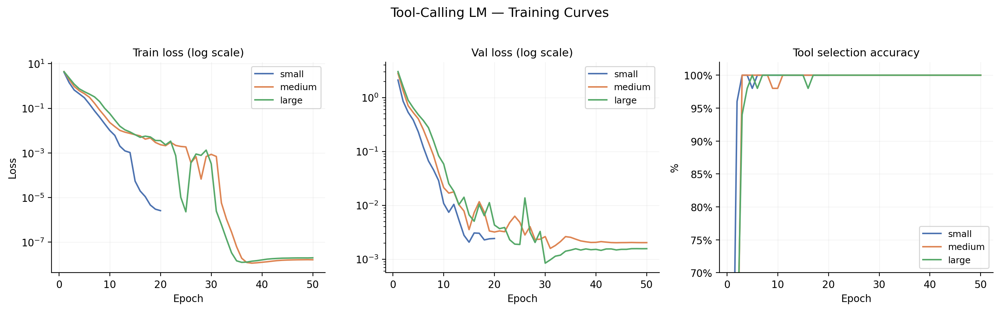
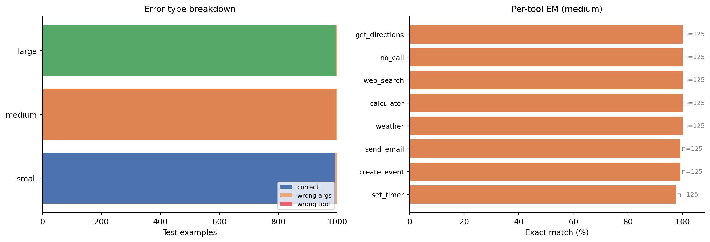

Can a tiny model built in pure NumPy — no PyTorch, no frameworks — learn to map natural language to structured function calls? We found out, and the answer is more nuanced than the accuracy numbers suggest.

## What We Built

For our CSCI 5832 final project at CU Boulder, we constructed every component of a decoder-only Transformer by hand: a custom reverse-mode autograd engine, word-level tokenizer, sinusoidal positional encodings, multi-head causal self-attention, feed-forward layers, layer normalization, and an Adam optimizer. The entire stack runs in Python and NumPy, with CuPy as a drop-in GPU accelerator.

The task: given a natural-language query and a list of available tool signatures, output a structured function call of the form `CALL: tool_name(arg1="val1", arg2="val2")`, or `NO_CALL` when no tool applies.

## The Pipeline

The end-to-end system flows through nine stages — from template authoring to evaluation:



Each training example is formatted as a single autoregressive sequence:

```
<BOS> User: What's the weather tomorrow in Denver?
Available tools: weather(city, date), calendar(date), send_email(to, subject, body)
<CALL> weather(city="Denver", date="tomorrow") <EOS>
```

## Dataset Construction

We generated two synthetic datasets to study the effect of lexical diversity:

| Configuration | Train | Val | Test | Total | Vocab |
| --- | --- | --- | --- | --- | --- |
| 10k (low diversity) | 8,000 | 1,000 | 1,000 | 10,000 | 1,156 |
| 21k (high diversity) | 16,800 | 2,100 | 2,100 | 21,000 | 3,472 |

The pipeline had four stages: **template authoring** (300+ query templates across 7 tool categories), **slot filling** (100+ city names, 50+ date expressions, 30+ common names), **paraphrase augmentation** via GPT-4 (applied to ~30% of examples), and **sequence formatting**.

The 21k dataset introduced deliberately harder entities — rare cities like Caracas, Sarajevo, and Maracaibo; uncommon names like Olu, Omar, and Khalid; unusual timer durations like 25, 35, and 120 minutes.

## Model Architecture

We trained three model variants:

| Variant | d_model | Layers | Heads | FFN dim | Params |
| --- | --- | --- | --- | --- | --- |
| Small | 128 | 2 | 4 | 512 | ~1.3M |
| Medium | 192 | 3 | 6 | 768 | ~2.7M |
| Large | 256 | 4 | 8 | 1024 | ~4.9M |

Key architectural choices: pre-norm LayerNorm, weight-tied language modeling head, GELU activations, sinusoidal (fixed) positional encodings, and causal masking. The Adam optimizer used linear warmup over 500 steps to a peak LR of 10⁻³, followed by cosine decay.

## Results

### On the 10k test set

| Model | EM | TSA | AEM | Arg F1 | NO_CALL |
| --- | --- | --- | --- | --- | --- |
| Small (1.3M) | 99.2% | 100% | 99.1% | 99.8% | 100% |
| Medium (2.7M) | 99.5% | 100% | 99.4% | 99.9% | 100% |
| Large (4.9M) | 99.4% | 100% | 99.3% | 99.9% | 100% |

### On the 21k test set

| Model | EM | TSA | AEM | Arg F1 | NO_CALL |
| --- | --- | --- | --- | --- | --- |
| Small (1.3M) | 98.0% | 100% | 97.5% | 99.7% | 100% |
| Medium (2.7M) | 99.0% | 100% | 98.9% | 99.9% | 100% |
| Large (4.9M) | 97.0% | 100% | 96.4% | 99.6% | 100% |

The metric comparison across model sizes for the 10k configuration is shown below:



**Tool selection is universally solved.** Every model hits 100% Tool Selection Accuracy (TSA) on both datasets. Every single error in every experiment is an *argument* error — not a wrong tool.

## Training Dynamics: Coarse-to-Fine Learning

The training curves reveal a clear pattern:



- **Epochs 1–5:** Tool routing is solved. TSA jumps from ~36% to 100%.
- **Epochs 5–50:** Argument extraction refines slowly, with loss continuing to fall.

On the 10k small model: Epoch 1 → train loss 4.13, TSA 36%. Epoch 2 → train loss 1.43, TSA 96%. Epoch 3 onward → TSA at 100%, loss keeps falling. The model learns *what tool to call* long before it learns *exactly how to fill the arguments*.

## The Large Model Paradox

> The 4.9M parameter model makes 44 errors on the 21k test set — more than twice the 20 errors made by the 2.7M medium model.

The large model's `weather` accuracy on 21k collapses to **84.4%**, a 13-point drop from the medium model's 97.6%. Our interpretation: larger capacity enables stronger memorization of training co-occurrences. When a rare entity appears at test time, the larger model *more confidently* substitutes a high-frequency training candidate. The medium model, unable to memorize as deeply, falls back to structural patterns that generalize better.

This reflects a known property of neural language models: additional capacity can hurt generalization when training data is not sufficiently diverse relative to the test distribution.

## Error Taxonomy

The formal errors cluster into three modes, all drawn from actual model outputs:

| Error Mode | Gold Output | Predicted Output |
| --- | --- | --- |
| Proper noun substitution | `weather(city="Caracas",...)` | `weather(city="Maracaibo",...)` (Small) |
| Numeric drift | `set_timer(minutes=35)` | `set_timer(minutes=7)` (Small) |
| Template bleed-through | `create_event(title="Guitar Lesson",...)` | `create_event(title="Piano Lesson",...)` |
| Slot ordering | `create_event(title="Sprint Planning", date="...", time="12:30 PM")` | `create_event(title="the day after tomorrow", date="12:30 PM")` |

The error breakdown and per-tool performance for the medium model is visualized below:



**Proper noun substitution** is the most revealing failure. "Caracas" becomes "Maracaibo" in the small model (both Venezuelan cities — the model has learned geographic co-occurrence), "The Hague" in the medium, and "Aspen" in the large. The model has learned the *slot pattern* but not how to *copy the specific token* from the current input.

**Numeric drift** is similarly diagnostic. Requesting 35 minutes produces 7, 10, or 10 across the three models. The model outputs durations it saw frequently in training; there is no evidence of token copying.

**Template bleed-through** is arguably the most instructive: it reveals that argument extraction is partially *memorization-based*, not compositional. The model is retrieving a `(create_event, probable_title)` pair from training memory rather than parsing the current query.

## Live OOD Failures

Our formal test set is in-distribution. Live inference on novel queries tells a harsher story:

- `"Will it be warm enough for a picnic in Austin on Sunday?"` → `weather(city="Dublin", date="Sunday")`
- `"How cold will it be in Anchorage on December 15th?"` → `weather(city="Anchorage", date="December 25th")` ("25th" is more common; the Christmas association dominates)
- `"Send an email to Khalid about the project deadline"` → `send_email(to="Wendy", subject="the group project")`

The formal 1–3% error rate measures in-distribution memorization. The live failures expose the underlying grounding problem.

## What Metrics Miss

- **Argument F1** stays at 99.6–99.9% even in failure cases, because errors are single-entity substitutions. EM and F1 carry nearly the same signal for our error distribution.
- **Perplexity** is uninformative at this scale. When validation loss is 0.016, PPL ≈ 1.016 — differences across models are less than 0.02.
- **NO_CALL accuracy at 100%** may not reflect genuine generalization. Our NO_CALL examples are clearly off-topic. Near-miss queries like "What time is it in Denver?" (weather-adjacent but no tool applies) would be far harder.

## Takeaway

A 1.3–4.9M parameter Transformer built entirely from scratch can achieve 97–99.5% exact-match accuracy on structured tool calling — but high in-distribution accuracy can mask brittle argument grounding that only surfaces in live evaluation. The model learns *to route* quickly and *to extract* slowly, and what it ultimately learns is closer to memorization than compositional parsing. The live demo failures are a useful correction to what the formal numbers suggest.

---

*This project was completed by Pratik Pujari, Gunabhiram Aruru, and Nirajan Paudel for CSCI 5832 – Introduction to Natural Language Processing, University of Colorado Boulder, Spring 2026. Faculty Advisor: Professor Maria Antoniak.*

The full implementation — autograd engine, tokenizer, model, training loop, and dataset generation pipeline — is available on GitHub: [github.com/paudelnirajan/tool-calling-LM](https://github.com/paudelnirajan/tool-calling-LM)
